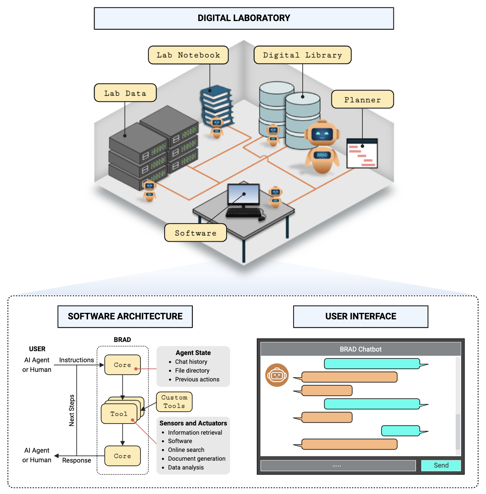

.. _about:

About BRAD
==========

Vision
------

Digital biology is experiencing a revolution driven by recent technological advancements. The `Twin Cell Program <https://rajapakse.lab.medicine.umich.edu/twincell-blueprint>`_ aims to develop an autonomous laboratory and a digital twin of a cell to study cellular reprogramming `in silico`.

BRAD plays a crucial role in this digital twin and automation initiative. Its primary objective is to create an interactive AI assistant and agentic system that automates and streamlines standard bioinformatics workflows. By integrating bioinformatics tools with large language models (LLMs), BRAD facilitates a variety of tasks, including constructing and querying databases, executing software pipelines, and generating responses to user queries based on curated information.

Beyond its role in the Twin Cell Program, we hope a collaborative AI will be a beneficial tool and worthy of open source development for the bioinformatics and research community.

Key Features
------------

This project focuses on developing a system that leverages LLMs to support various bioinformatics research tasks. The core of BRAD involves designing and implementing a modular framework to assist in activities such as literature searches, gene enrichment analysis, and software execution. Key features include:

- **User Interface**: A Graphical User Interface (GUI) is provided for ease of use, and the BRAD python codes can be accessed as a package as well.

- **Modular Architecture**: The system's modular design allows for flexibility in integrating and utilizing diverse tools and components, enabling users to customize their workflows.

- **Automated Workflows**: BRAD automates repetitive and well-defined tasks, such as executing predefined software pipelines and performing standard gene enrichment.

- **Information Retrieval**: The system incorporates mechanisms for retrieving and processing information from various sources, including literature repositories and online databases.

- **Custom Code Execution**: Users can execute custom code in Python allowing for the performance of specialized tasks tailored to their specific research needs.

While BRAD supports all of these features, some features require different interfaces. For instance, using BRAD to run code through the GUI is rather challenging, but the GUI provides an improved interface for literature searches.

Future Work
-----------

Ongoing efforts for this project currently entail:

1. Improving the GUI and accessibility of the code
2. Improving the RAG pipeline
3. Improving communication among multiple BRAD agents

Future development will prioritize refining planning and execution processes to support the creation of a more autonomous digital laboratory environment.

